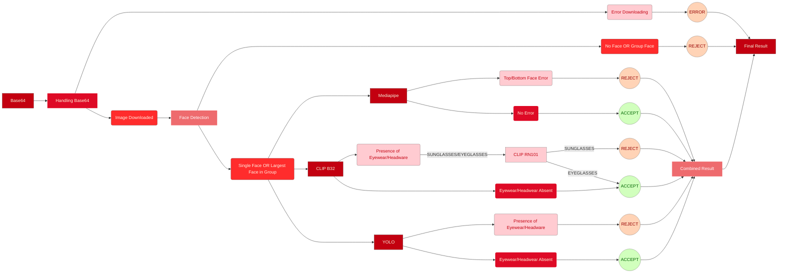

# Profile Moderation System - Version 10 (Gradio Testing)

## Overview
> Version 10 of the Profile Moderation System integrates advanced image processing techniques and AI models for image validation and testing it using Gradio. This version introduces improved modularity and enhanced performance for NSFW detection, face cropping, eyewear detection, and object classification. It supports image URLs, base64-encoded image data, and provides a seamless experience in moderating profile images.

## Model Configuration Update

- **Base64 Support:** Image URLs are no longer the only input method; the system can now process base64-encoded images for greater flexibility.
- **Improved Face Detection:** Enhanced algorithms for accurate face detection, ensuring that single and multiple face scenarios are handled effectively.
- **Refined Eyewear Detection:** Integration with CLIP and RN101 models for more accurate classification of eyewear and headwear items such as sunglasses and glasses.
- **NSFW Detection:** The NSFW model is now more tightly integrated into the image processing flow, providing more reliable content moderation.

### Version 9:
- The input type is a Image URL.
- The system used OpenCV for loading images from the URL and PIL for face cropping.
- NSFW detection was performed using a pre-trained ViT-based model.

### Version 10:
- **Input Types: Supports both Image URL and Base64-encoded Image Data.
- **Face Detection:** Refined face detection using InsightFace and MediaPipe.
- **Face Cropping:** Direct image handling with PIL images instead of NumPy arrays for better compatibility.
- **Eyewear and Headwear Detection:** Uses CLIP and RN101 models for classifying eyewear and headwear.
- **NSFW Content Detection:** Enhanced workflow using a more efficient method for NSFW classification using the Vision Transformer (ViT) model.

**Warning:** This is explicitely built for testing if the model handles the use case of Face Occlusion on a 'Gradio' server. Refer to the 'Releases' for the 'Production Version'.

## Flow Diagram
