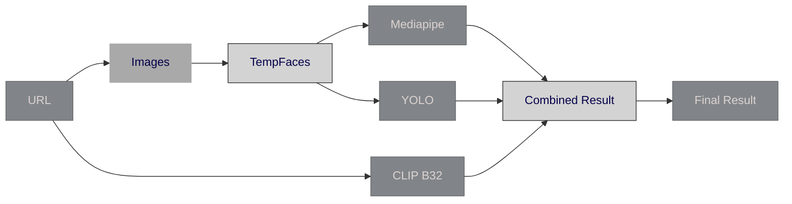
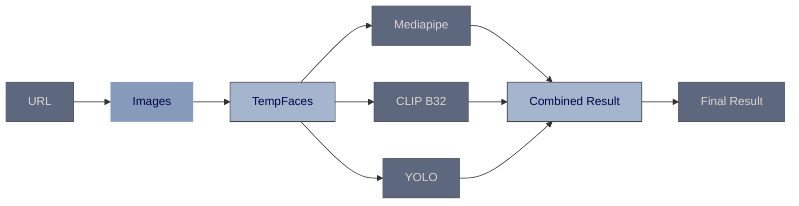

# Face Occlusion Detection - Version 2

## Overview
> Version 2 of the Face Occlusion Detection project introduces significant improvements and changes over Version 1. These enhancements streamline the image processing workflow and improve accuracy in detecting face occlusions. This version now handles image paths instead of URLs across all models, addressing issues related to face cropping and multi-face detection.

## Major Differences from Version 1

### 1. Image Processing Workflow

### Version 1:
- Images were Downloaded and stored in `Images` folder and `TempFaces` folder initially for use in **Face Recognition** _(Part 1)_, **Mediapipe** _(Part 2)_, and **YOLO** _(Part 4)_.
- **CLIP** _(Part 3)_ continued to use **Image URL** for its analysis.

### Version 2:
- Images are first downloaded and stored in `Images` folder and `TempFaces` folder.
- All models (Face Recognition, Mediapipe, YOLO, and CLIP) now use the **Image Path** for analysis.

### 2. Handling of Multiple Faces

### Version 1:
- If `Number of Faces Detected > 1`, it resulted in image rejection due to **Multiple Faces Error**.

### Version 2:
- Recognizes and processes images with only one primary subject in focus.
- Introduces a new function `save_faces` to manage and pass single face images to subsequent models.

## Version 1

## Version 2

