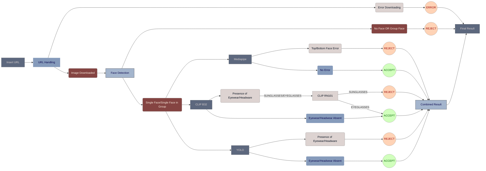

# Face Occlusion Detection - Version 8 (Dummy Version)

## Overview
> Version 8 of the Face Occlusion Detection project builds upon the capabilities introduced in Version 7, focusing on maintaining same functionalities along with addressing specific scenarios related to face occlusion analysis. This version includes handling of the Temporary Folders being deleted after successful execution of the code.

## Model Configuration Update

### Version 7:
- The temporary folders 'Images', 'TempFaces' were not being deleted.

### Version 8:
- The temporary folders 'Images', 'TempFaces' were are now being deleted.
- The problem was due to making of the 'Images' folder outside of the Working Directory and providing the Relative Path in the Code.

## Flow Diagram
