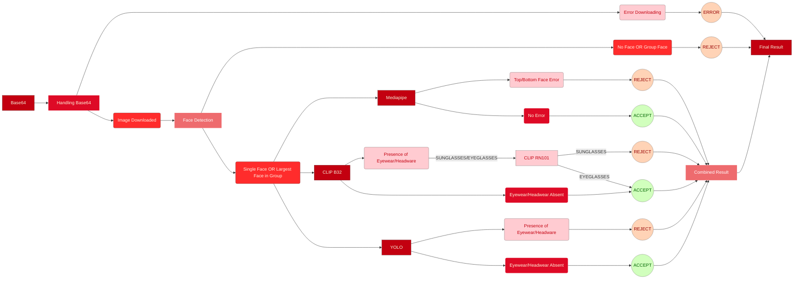

# Face Occlusion Detection - Version 9 (Dummy Version)

## Overview
> Version 9 of the Face Occlusion Detection project introduces significant improvements and optimizations in the image processing pipeline. This update focuses on enhancing image handling (support for base64 image data), refactoring functions for better modularity, and improving model performance for NSFW detection, face cropping, and classification tasks.

Is discarded due to not detecting faces properly.

## Model Configuration Update:

### Version 8:
- The **input type** is a **Image URL**.
- 'detect_nsfw()' function used OpenCV to load images from disk.
- 'crop_faces()' and 'save_face()' accepts images in form of **NumPy arrays**.

### Version 9:
- Added functionality to handle **base64-encoded image data** in 'base64_to_image()'. This allows for more flexible input options, such as receiving images as base64 strings.
- 'detect_nsfw()' has been updated to process images directly from the PIL image object, allowing for smoother integration with the new base64-to-image pipeline.
- 'crop_faces()' and 'save_face()' functions now directly accept PIL images rather than NumPy arrays, aligning with the image format. 

## Flow Diagram
