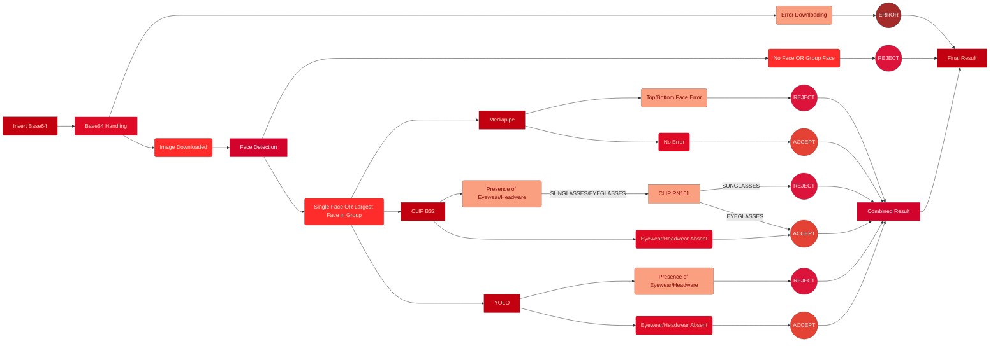

# Face Occlusion Detection - Version 9 (Discarded Version)

## Overview
> Version 9 of the Face Occlusion Detection project introduces significant improvements and optimizations in the image processing pipeline. This update focuses on enhancing image handling (support for base64 image data), refactoring functions for better modularity, and improving model performance for NSFW detection, face cropping, and classification tasks.

## Model Configuration Update

- **Base64 Support:** Image URLs are no longer the only input method; the system can now process base64-encoded images for greater flexibility.
- **Improved Face Detection:** Enhanced algorithms for accurate face detection, ensuring that single and multiple face scenarios are handled effectively.
- **Refined Eyewear Detection:** Integration with CLIP and RN101 models for more accurate classification of eyewear and headwear items such as sunglasses and glasses.
- **NSFW Detection:** The NSFW model is now more tightly integrated into the image processing flow, providing more reliable content moderation.

### Version 8:
- The **input type** is a **Image URL**.
- 'detect_nsfw()' function used OpenCV to load images from disk.
- 'crop_faces()' and 'save_face()' accepts images in form of **NumPy arrays**.

### Version 9:
- Added functionality to handle **base64-encoded image data** in 'base64_to_image()'. This allows for more flexible input options, such as receiving images as base64 strings.
- 'detect_nsfw()' has been updated to process images directly from the PIL image object, allowing for smoother integration with the new base64-to-image pipeline.
- 'crop_faces()' and 'save_face()' functions now directly accept PIL images rather than NumPy arrays, aligning with the image format. 

**Warning:** This is explicitely built for testing if the model handles the use case of Face Occlusion on a 'Gradio' server. Refer to the 'Releases' for the 'Production Version'.

## Flow Diagram
