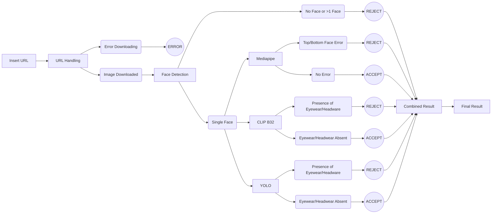

# Face Occlusion Detection - Version 1

## Overview
 > Version 1 of the Face Occlusion Detection project focuses on merging all the subparts as well as implementing Gradio for demonstration purposes. It involves a sequential process to evaluate images for **Acceptance** or **Rejection** based on **Face Occlusion Analysis**.

## Steps Implemented in Version 1
1. **Image URL Validation and Download**
   - Checks the validity of the image URL.
   - Downloads the image in PNG format if the extension is supported.
   - Images are stored in the `Images` folder.


2. **Face Analysis Using Insight Face & Face Recognition**
   - Utilizes Insight Face for face detection and analysis.
   - Checks for presence of exactly one face.
   - Performs initial face occlusion detection using Face Recognition.


3. **Facial Landmark Detection with Mediapipe**
   - Detects faces using Mediapipe on the downloaded images.
   - Crops faces with a 30% expansion ratio and saves them in `TempFaces` folder.
   - Performs landmark detection on both halves of the cropped face.


4. **Textual Image Analysis with CLIP**
   - Uses CLIP (B32) for textual image analysis.
   - Detects the presence of eyewear or headwear in the image URL.


5. **Object Detection with YOLO**
   - Utilizes YOLO (v8) to detect eyewear or headwear in the downloaded images.
   - Handles streaming mode for webp images.


## Decision Making
- Images are accepted if all steps confirm the absence of significant occlusions like eyewear, headwear, or incomplete facial features.
- Rejected images are flagged with specific errors indicating the reason for rejection.


## Installation
To set up Version 1 locally:

1. Clone the repository:
   ```sh
   git clone https://github.com/AbhigyanSen/ABP.git
   cd ABP/Version1
2. Install the required dependencies:
   ```sh
   pip install -r ../requirements.txt 
3. Start the Server:
   ```sh
   python gradio.api.py
## Flow Diagram

## Future Versions
Future versions will build upon Version 1's foundation, integrating additional models and refining the detection process for enhanced accuracy and reliability.