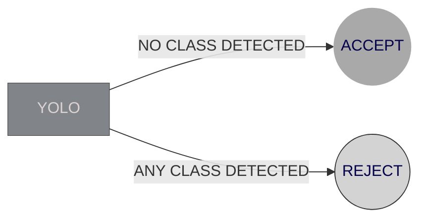
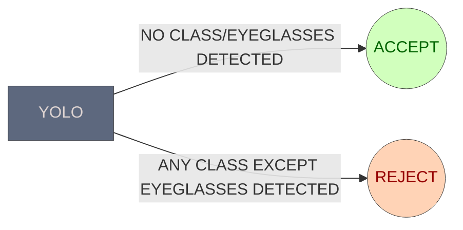

# Face Occlusion Detection - Version 3

## Overview
> Version 3 of the Face Occlusion Detection project builds upon the advancements of Version 2 with targeted improvements to enhance accuracy and refine the handling of specific occlusion types. This version introduces nuanced changes in the decision-making process to better classify images based on detected eyeglasses, addressing previous discrepancies.

## Eyewear Classification Enhancement

##### Version 2:
- Images were **Rejected** if **YOLO** detect any of the classes.

##### Version 3:
- In **YOLO**, if the detected class was `eyeglasses`, then the Image was **Accepted**.

## Seamless Path Updation for Server Deployment

##### Version 2:
- While deploying the model on the server finally, certain path changes `yolo_model` and `base_folder` were necessary. It was combursome to solve them.

##### Version 3:
- Now both the paths can be updated seamlessly via `YOLO_FOLDER` and `BASE_FOLDER`.

## Version 2

## Version 3

