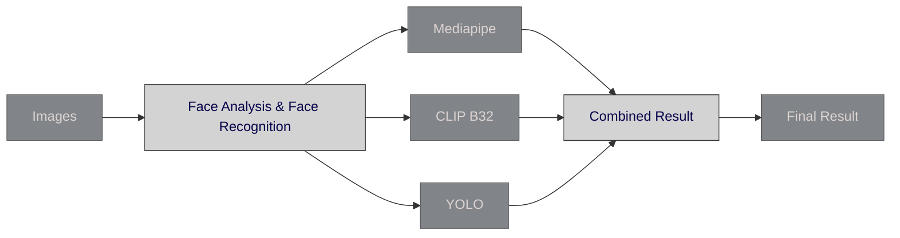
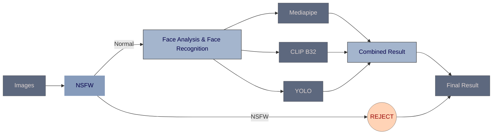

# Face Occlusion Detection - Version 4

## Overview
> Version 4 of the Face Occlusion Detection project introduces a new model integration from Falcon AI to enhance image classification capabilities. This version focuses on improving the filtering process by directly rejecting images classified as Not Safe For Work (NSFW), thus optimizing the workflow and ensuring content appropriateness.

## Integration of NSFW Detection Model

##### Version 3:
- No Obscence Images were **Rejected**.

##### Version 4:
- If any obscene image was found, it will be **Rejected** _(in part 1)_ now and not processed further.

## Version 3

## Version 4

