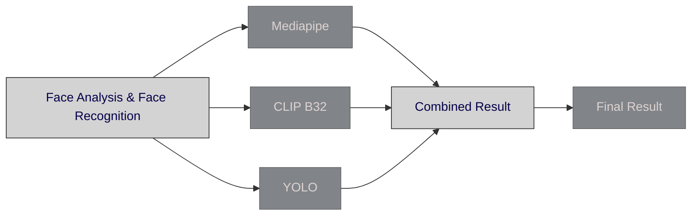
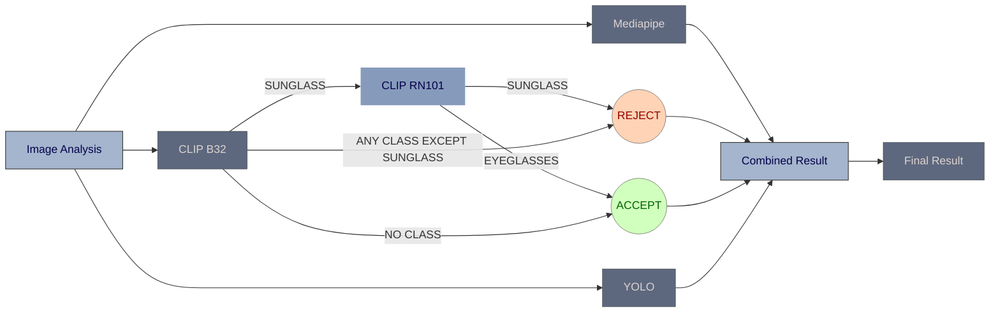

# Face Occlusion Detection - Version 3

## Overview
> Version 5 of the Face Occlusion Detection project introduces the RN101 model for enhanced classification between eyeglasses and sunglasses. This version aims to improve accuracy in identifying specific types of occlusions, thereby refining the decision-making process for image acceptance or rejection

## Integration of RN101 Model

##### Version 4:
- The CLIP B32 Model was struggling to differentiate between eyeglasses and sunglasses and hence **Rejected** eyeglasses.

##### Version 5:
- A new check was implemented by adding RN101 to confirm the presence of eyeglasses. Hence, there was an imporvement in parsing sunjects wearing eyeglasses.

## Version 4

## Version 5
