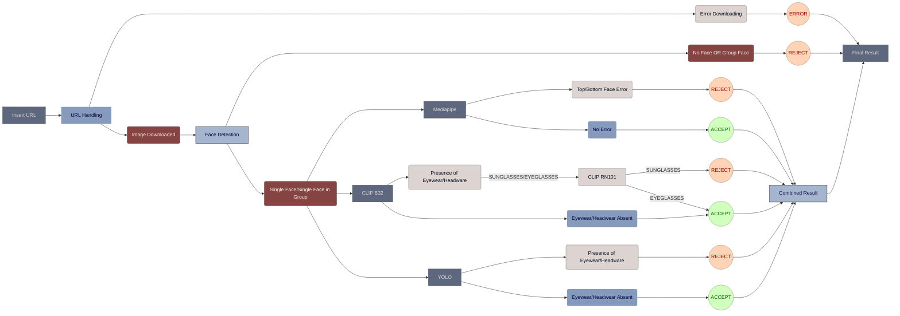

# Face Occlusion Detection - Version 6

## Overview
> Version 6 of the Face Occlusion Detection project builds upon the capabilities introduced in Version 5, focusing on improving accuracy and addressing specific scenarios related to face occlusion analysis. This version includes updates to path configurations, error handling, and model confidence thresholds to enhance the overall functionality and reliability of the system.

## Model Configuration Update

### Version 5:
- The **CLIP B32** Model was struggling to differentiate between eyeglasses and sunglasses with thresholding at **0.8**.

### Version 6:
- The Thresholding was updated from **0.8** to **0.5** to make sure that eyeglasses are parsed by **RN101**.

## Debugging Notes _(Developers)_:
- 30:  Model Loading Error        (Face Analysis)
- 88:  NSFW Label
- 151: print(e)                   (deleted)
- 253: Confidence for CLIP B32
- 264: RN101 Acceptance 
- 272: Detected Class for CLIP B32 in 80% Confidence
- 314: Combined Result 
- 315: Combined Result
- 329: Acceptance by RN101        (Eyeglass in CLIP, Sunglass in YOLO)

## Flow Diagram
