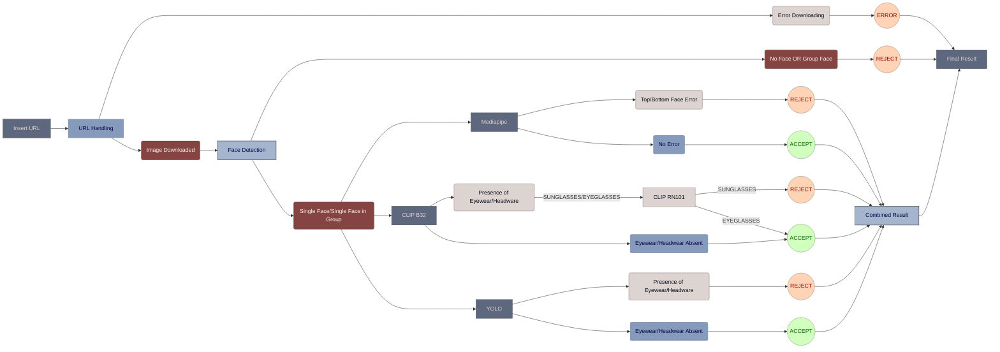

# Face Occlusion Detection - Version 7

## Overview
> Version 7 of the Face Occlusion Detection project builds upon the capabilities introduced in Version 6, focusing on improving accuracy and addressing specific scenarios related to face occlusion analysis. This version includes updates to path configurations, error handling, and model confidence thresholds to enhance the overall functionality and reliability of the system.

## Model Configuration Update

### Version 7:
- Enhanced detection capabilities for face occlusion using various models.
- Robust error handling for image processing and model inference.
- Updated paths for Image storage and Model Weights.

## Flow Diagram
