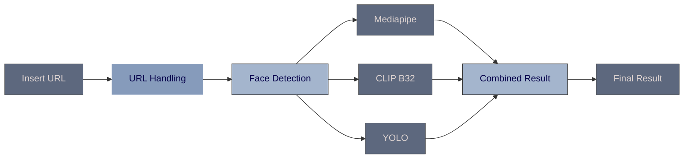

# Face Occlusion Detection
#####  This project focuses on determining the **Acceptance** or **Rejection** of images based on face occlusion analysis. The system evaluates images for the presence and clarity of facial features to ensure reliable identification.

[](https://github.com/AbhigyanSen/ABP/tree/main/Version5)

The code leverages several deep learning models and techniques:
+ **Face Detection and Cropping:** 
Utilizes InsightFace for face detection and cropping to isolate facial regions from images.
+ **Facial Landmark Detection:** 
Uses MediaPipe for detecting facial landmarks to assess the completeness of facial features.
+ **Text and Image Analysis:** 
Integrates CLIP (Contrastive Language-Image Pre-training) for analyzing images based on textual descriptions, identifying potential occlusions such as hats or masks.
+ **Object Detection:** 
Employs YOLO (You Only Look Once) for detecting objects like sunglasses, eyeglasses, headwear, etc., which may occlude facial features.

The project implements a comprehensive approach combining multiple modalities to make a final decision regarding the acceptance of images. It aims to enhance the accuracy and reliability of face recognition systems by addressing common challenges posed by occlusions.

## Features

- Detects faces in images using InsightFace for precise localization.
- Applies facial landmark detection with MediaPipe to ensure facial feature completeness.
- Utilizes YOLO (You Only Look Once) for object detection to identify potential occlusions like sunglasses, hats, and masks.
- Integrates CLIP (Contrastive Language-Image Pre-training) for analyzing images based on textual descriptions to further assess occlusion presence.
- Provides a comprehensive decision-making process for image acceptance based on combined results from multiple detection and analysis techniques.
- Supports real-time processing of image data, making it suitable for applications requiring immediate feedback on image quality and content.

## Installation

_This repository requires [Python](https://www.python.org/downloads/) 3.12 to run._
```sh
python --version
pip --version
git clone https://github.com/AbhigyanSen/ABP.git
```

Create a Virtual Environment
```sh
cd ABP
python -m venv env
```

Install the libraries and start the **Gradio Server**.
```sh
pip install torch torchvision ftfy regex tqdm open_clip_torch insightface pandas openpyxl requests onnxruntime onnxruntime insightface opencv-python-headless mediapipe face_recognition pillow ultralytics Flask gradio
pip install git+https://github.com/openai/CLIP.git
```
```sh
python main.py
```
or
```sh
pip install -r requirements.txt
python main.py
```

## Flow Diagram

